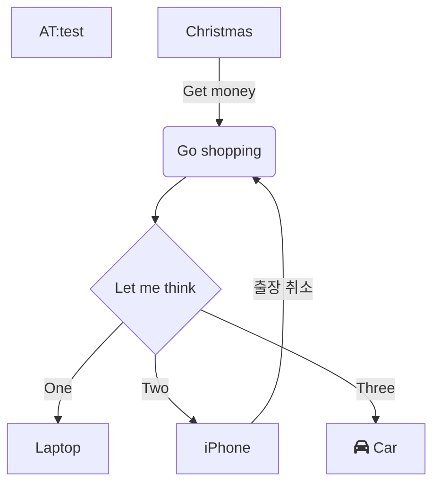
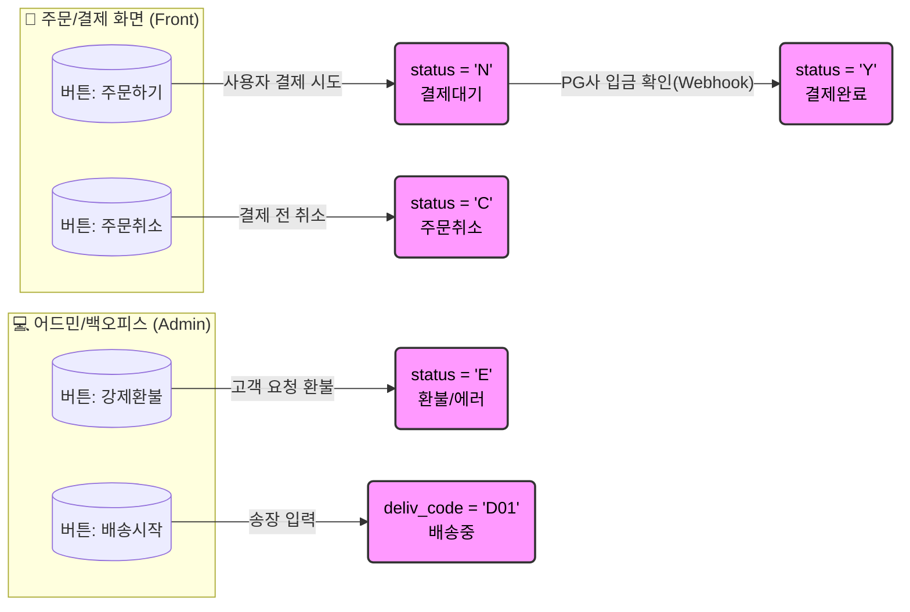

[자바스크립트 비동기와 이벤트 루프](https://inpa.tistory.com/entry/%F0%9F%94%84-%EC%9E%90%EB%B0%94%EC%8A%A4%ED%81%AC%EB%A6%BD%ED%8A%B8-%EC%9D%B4%EB%B2%A4%ED%8A%B8-%EB%A3%A8%ED%94%84-%EA%B5%AC%EC%A1%B0-%EB%8F%99%EC%9E%91-%EC%9B%90%EB%A6%AC)

[Basic Python GUI Programming](https://wikidocs.net/book/8908)

QEvent subclass
- Spontaneous Events : OS로부터 생성된 event.
  - Spontaneous events 발생시 system queue에 push되며
  - 비동기 방식 으로 처리됨 (event loop에서 pop됨).
- Posted Events : Qt 나 Application에 의해 생성된 event.
  - Posted event를 다루기 위한 queue에 push됨.
  - 비동기방식 으로 처리됨 (event loop에서 pop됨).
- Sent Events : Qt나 application에 의해 생성되며 동기식으로 처리.
  - 직접적으로 이를 처리할 QObject instance (=Event Handler)로 보내짐.
  - 동기방식 으로 처리됨.

[python file,directory 관련 os 모듈 함수](https://ds31x.tistory.com/25)

[python 삼항연산자가 없는 이유](https://leapcell.io/blog/ko/why-python-go-and-rust-dont-use-the-ternary-operator)

- `: ?` 구문이 선택되지 않은 이유
  - python에서 이미 많은 용도로 사용되는 :(콜론)
  - C와 유사한 언어에 익숙하지 않으면 직관적이지 않음 (**너무 추상적임**)
- `X if C else Y`이 선택된 이유
  - "명시적인 것이 암시적인 것보다 낫다"는 Python의 스타일을 따름
  - 기존에 존재하던 키워드 조합만으로 사용 가능
  - `and-or` 패턴의 대체 가능

[x86이 남아있는 이유](https://www.reddit.com/r/programming/comments/1bpdotb/why_x86_doesnt_need_to_die/?tl=ko)

[Python Challenge: Converts boolean to ‘Yes’ or ‘No’](https://medium.com/@pythonchallengers/learn-4-different-ways-to-solve-this-python-challenge-level-easy-f916da74dd11)

