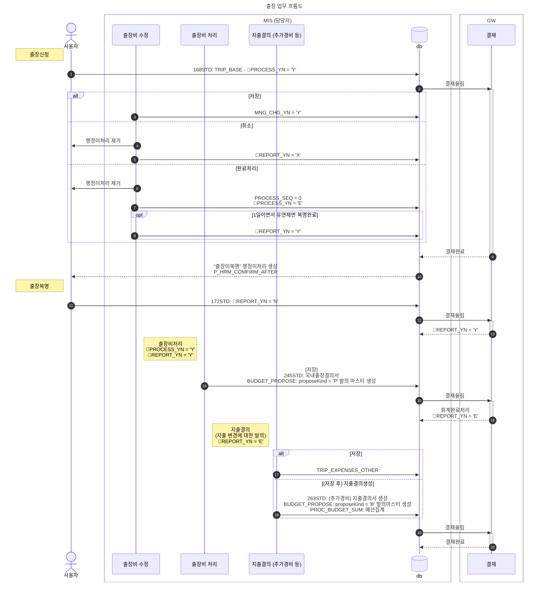

mermaid 장점
- 문서화 쉬움
- 관리하기 쉬움 (소스형태로 저장)

단점
- 복잡해지면 가독성 ↓ (자동으로 그리기 때문)

Markdown Preview Mermaid Support는 mermaid 버전이낮아, @json이 지원이 안되는게 많음.  
mermaid chart의 공식을 설치함

```mermaid
---
title: "출장 업무 흐름도"
---
sequenceDiagram
    autonumber
    
    actor act as 사용자

    box MIS (담당자)
        participant mod as 출장비 수정
        participant pay as 출장비 처리
        participant exp as 지출결의 (추가경비 등)
        participant db@{ "type" : "database" }
    end

    box GW 
        participant gw as 결재
    end
    
    %% CODE 51
    %% TA	국내출장
    %% TD	근거리출장
    %% TF	해외출장

    %% 출장신청 
    Note left of act: 출장신청

    act->>db: 168STD: TRIP_BASE - 🔴PROCESS_YN = 'Y'
    activate mod
    db->>gw: 결재올림
    activate gw
    alt 저장
        mod->>db: MNG_CHG_YN = 'Y'
    else 취소
        mod->>act: 행정미처리 제거
        mod->>db: 🔵REPORT_YN = 'X'
    else 완료처리
        mod->>act:행정미처리 제거
        mod->>db: PROCESS_SEQ  = 0 <br> 🔴PROCESS_YN   = 'E'
        opt 1일이면서 유연제면 복명완료
            mod->>db: 🔵REPORT_YN   = 'Y' 
        end
    end

    gw-->>db: 결재완료
    deactivate gw
    db-->>act: "출장미복명" 행정미처리 생성 <br> P_HRM_COMFIRM_AFTER


    %% 출장복명
    Note left of act: 출장복명
    
    act->>db: 172STD: 🔵REPORT_YN = 'N'

    db->>gw: 결재올림
    activate gw
    gw-->>db: 🔵REPORT_YN = 'Y'
    deactivate gw

    %% 출장비처리
    Note left of pay: 출장비처리 <br> 🔴PROCESS_YN = 'Y'<br> 🔵REPORT_YN = 'Y'

    pay->>db: [저장] <br> 245STD: 국내출장결의서 <br> BUDGET_PROPOSE: proposeKind = 'P' 발의 마스터 생성
    db->>gw: 결재올림
    activate gw
    gw-->>db: 회계완료처리<br>🔵REPORT_YN = 'E' 
    deactivate gw

    %% 지출결의
    Note left of exp: 지출결의 <br> (지출 변경에 대한 발의) <br>🔵REPORT_YN = 'E'
    alt 저장
        exp->>db: TRIP_EXPENSES_OTHER
    else (저장 후) 지출결의생성
        exp->>db: 263STD: (추가경비) 지출결의서 생성 <br>BUDGET_PROPOSE: proposeKind = 'B' 발의마스터 생성 <br> PROC_BUDGET_SUM: 예산집계
    end

    db->>gw: 결재올림
    activate gw
    gw-->>db: 결재완료
    deactivate gw
```

