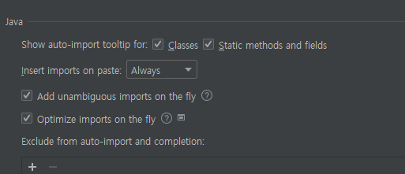
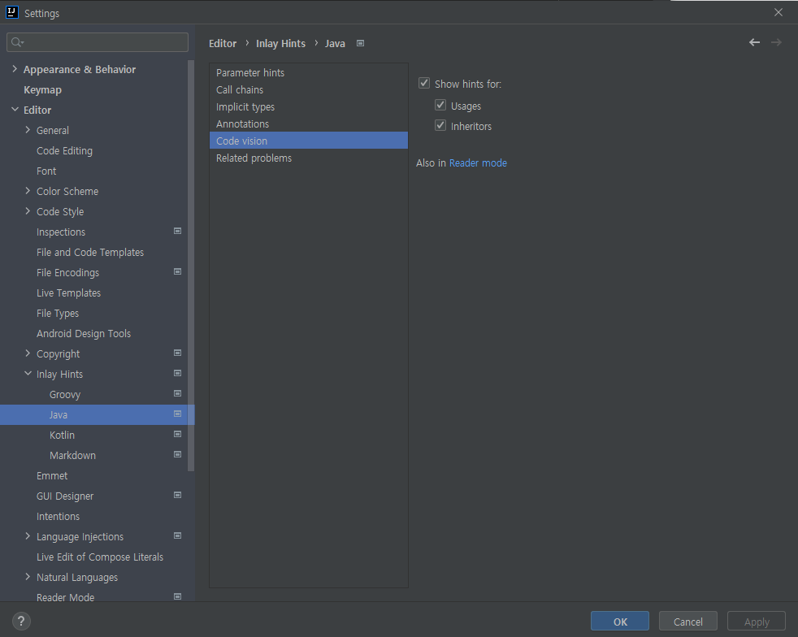

### Auto import
* 설정(Ctrl + Alt + s) - Editor - General - Auto Import
    

### 한글깨짐
https://www.lesstif.com/java/intellij-file-console-encoding-121012310.html
* 콘솔깨짐 -> -Dconsole.encoding=UTF-8
로 해결

### usages
